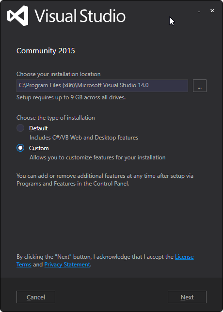
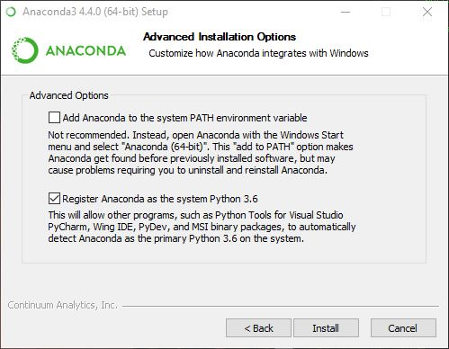
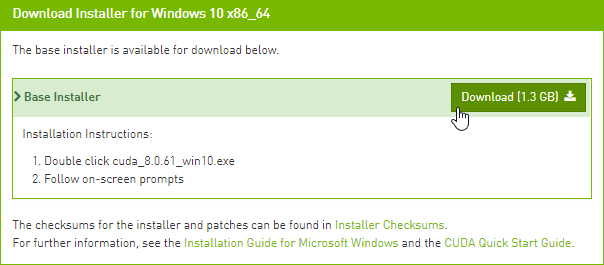
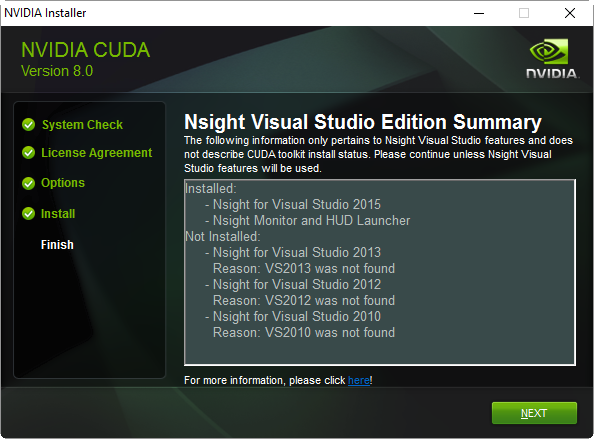
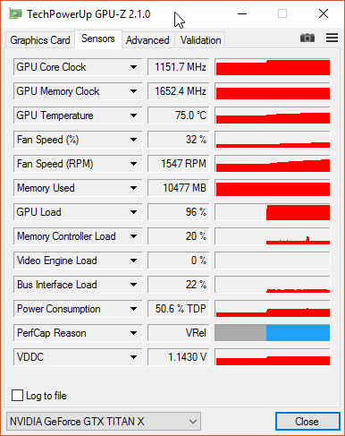
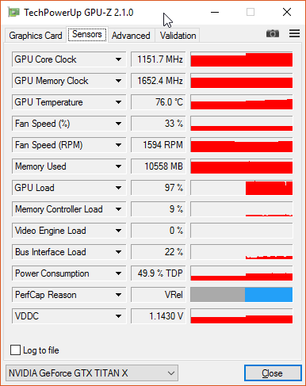
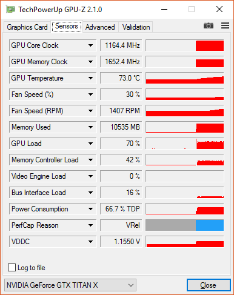

GPU-accelerated Keras with Tensorflow, Theano, or CNTK on Windows 10 native
===================================================

**>> LAST UPDATED JULY, 2017 <<**

**This latest update allows the native use of 3 different GPU-accelerated backends, adds support for the MKL BLAS library (no more OPEN BLAS) and uses libgpuarray by default with Theano. Also, using our own version of MinGW isn't necessary anymore.**

There are certainly a lot of guides to assist you build great deep learning (DL) setups on Linux or Mac OS (including with Tensorflow which, unfortunately, as of this posting, cannot be easily installed on Windows), but few care about building an efficient Windows 10-**native** setup. Most focus on running an Ubuntu VM hosted on Windows or using Docker, unnecessary - and ultimately sub-optimal - steps.

We also found enough misguiding/deprecated information out there to make it worthwhile putting together a step-by-step guide for the latest stable versions of Theano and Keras. Used together, they make for one of the simplest and fastest DL configurations to work natively on Windows.

If you **must** run your DL setup on Windows 10, then the information contained here may be useful to you.

Older installation instructions from [May 2017](README_May2017.md) and [January 2017](README_Jan2017.md) are still available.

# Dependencies
Here's a summary list of the tools and libraries we use for deep learning on Windows 10 (Version 1607 OS Build 14393.222):

1. Visual Studio 2015 Community Edition Update 3 w. Windows Kit 10.0.10240.0
   - Used for its C/C++ compiler (not its IDE) and SDK. This specific version has been selected due to [Windows Compiler Support in CUDA 8.0.61](http://docs.nvidia.com/cuda/cuda-installation-guide-microsoft-windows/index.html#system-requirements).
2. Anaconda (64-bit) w. Python 3.6 (Anaconda3-4.4.0) [for Tensorflow support] or Python 2.7 (Anaconda2-4.4.0) [no Tensorflow support] with MKL
   - A Python distro that gives us NumPy, SciPy, and other scientific libraries
   - MKL is used for its CPU-optimized implementation of many linear algebra operations
3. CUDA 8.0.61 (64-bit)
   - Used for its GPU math libraries, card driver, and CUDA compiler
4. cuDNN v5.1 (Jan 20, 2017) for CUDA 8.0
   - Used to run vastly faster convolution neural networks
5. Keras 2.0.5 with three different backends: Theano 0.9.0, Tensorflow-gpu 1.2.0, and CNTK 2.0
   - Keras is used for deep learning on top of Theano, Tensorflow, or CNTK
   - Theano, Tensorflow, and CNTK are backends used to evaluate mathematical expressions on multi-dimensional arrays

# Hardware

1. Dell Precision T7900, 64GB RAM
   - Intel Xeon E5-2630 v4 @ 2.20 GHz (1 processor, 10 cores total, 20 logical processors)
2. NVIDIA GeForce Titan X, 12GB RAM
   - Driver version: 372.90 / Win 10 64

# Installation steps

We like to keep our toolkits and libraries in a single root folder boringly called `e:\toolkits.win`, so whenever you see a Windows path that starts with `e:\toolkits.win` below, make sure to replace it with whatever you decide your own toolkit drive and folder ought to be.

## Visual Studio 2015 Community Edition Update 3 w. Windows Kit 10.0.10240.0

Download [Visual Studio 2015 Community Edition](https://www.visualstudio.com/vs/older-downloads).

Run the downloaded executable to install Visual Studio, using whatever additional config settings work best for you:




1. Add `C:\Program Files (x86)\Microsoft Visual Studio 14.0\VC\bin` to your `PATH`, based on where you installed VS 2015.
2. Define sysenv variable `INCLUDE` with the value `C:\Program Files (x86)\Windows Kits\10\Include\10.0.10240.0\ucrt`
3. Define sysenv variable `LIB` with the value `C:\Program Files (x86)\Windows Kits\10\Lib\10.0.10240.0\um\x64;C:\Program Files (x86)\Windows Kits\10\Lib\10.0.10240.0\ucrt\x64`

> Reference Note: We couldn't run any Theano python files until we added the last two env variables above. We would get a `c:\program files (x86)\microsoft visual studio 14.0\vc\include\crtdefs.h(10): fatal error C1083: Cannot open include file: 'corecrt.h': No such file or directory` error at compile time and missing `kernel32.lib uuid.lib ucrt.lib` errors at link time. True, you could probably run `C:\Program Files (x86)\Microsoft Visual Studio 14.0\VC\bin\amd64\vcvars64.bat` (with proper params) every single time you open a MINGW cmd prompt, but, obviously, none of the sysenv vars would stick from one session to the next.

## Anaconda 4.4.0 (64-bit) (Python 3.6 TF support / Python 2.7 no TF support))

This tutorial was initially created using Python 2.7. As Tensorflow has become the backend of choice for Keras, we've decided to document installation steps using Python 3.6 by default. Depending on your own preferred configuration, use `e:\toolkits.win\anaconda3-4.4.0` or `e:\toolkits.win\anaconda2-4.4.0` as the folder where to install Anaconda.

Download the Python 3.6 Anaconda version from [here]((https://repo.continuum.io/archive/Anaconda3-4.4.0-Windows-x86_64.exe) and the Python 2.7 version from [there](https://repo.continuum.io/archive/Anaconda2-4.4.0-Windows-x86_64.exe):


Run the downloaded executable to install Anaconda:


> Warning: Below, we enabled the second of the `Advanced Options` because it works for us, but that may not be the best option for you!



Define the following variable and update PATH as shown here:

1. Define sysenv variable `PYTHON_HOME` with the value `e:\toolkits.win\anaconda3-4.4.0`
2. Add `%PYTHON_HOME%`, `%PYTHON_HOME%\Scripts`, and `%PYTHON_HOME%\Library\bin` to `PATH`

### Create a `dlwin36` conda environment

After Anaconda installation, open a Windows command prompt and execute:

```
$ conda create --yes -n dlwin36 numpy scipy mkl-service m2w64-toolchain libpython jupyter
Fetching package metadata ...........
Solving package specifications: .

Package plan for installation in environment e:\toolkits.win\anaconda3-4.4.0\envs\dlwin36:

The following NEW packages will be INSTALLED:

    bleach:                         1.5.0-py36_0
    colorama:                       0.3.9-py36_0
    decorator:                      4.0.11-py36_0
    entrypoints:                    0.2.2-py36_1
    html5lib:                       0.999-py36_0
    icu:                            57.1-vc14_0          [vc14]
    ipykernel:                      4.6.1-py36_0
    ipython:                        6.1.0-py36_0
    ipython_genutils:               0.2.0-py36_0
    ipywidgets:                     6.0.0-py36_0
    jedi:                           0.10.2-py36_2
    jinja2:                         2.9.6-py36_0
    jpeg:                           9b-vc14_0            [vc14]
    jsonschema:                     2.6.0-py36_0
    jupyter:                        1.0.0-py36_3
    jupyter_client:                 5.1.0-py36_0
    jupyter_console:                5.1.0-py36_0
    jupyter_core:                   4.3.0-py36_0
    libpng:                         1.6.27-vc14_0        [vc14]
    libpython:                      2.0-py36_0
    m2w64-binutils:                 2.25.1-5
    m2w64-bzip2:                    1.0.6-6
    m2w64-crt-git:                  5.0.0.4636.2595836-2
    m2w64-gcc:                      5.3.0-6
    m2w64-gcc-ada:                  5.3.0-6
    m2w64-gcc-fortran:              5.3.0-6
    m2w64-gcc-libgfortran:          5.3.0-6
    m2w64-gcc-libs:                 5.3.0-7
    m2w64-gcc-libs-core:            5.3.0-7
    m2w64-gcc-objc:                 5.3.0-6
    m2w64-gmp:                      6.1.0-2
    m2w64-headers-git:              5.0.0.4636.c0ad18a-2
    m2w64-isl:                      0.16.1-2
    m2w64-libiconv:                 1.14-6
    m2w64-libmangle-git:            5.0.0.4509.2e5a9a2-2
    m2w64-libwinpthread-git:        5.0.0.4634.697f757-2
    m2w64-make:                     4.1.2351.a80a8b8-2
    m2w64-mpc:                      1.0.3-3
    m2w64-mpfr:                     3.1.4-4
    m2w64-pkg-config:               0.29.1-2
    m2w64-toolchain:                5.3.0-7
    m2w64-tools-git:                5.0.0.4592.90b8472-2
    m2w64-windows-default-manifest: 6.4-3
    m2w64-winpthreads-git:          5.0.0.4634.697f757-2
    m2w64-zlib:                     1.2.8-10
    markupsafe:                     0.23-py36_2
    mistune:                        0.7.4-py36_0
    mkl:                            2017.0.3-0
    mkl-service:                    1.1.2-py36_3
    msys2-conda-epoch:              20160418-1
    nbconvert:                      5.2.1-py36_0
    nbformat:                       4.3.0-py36_0
    notebook:                       5.0.0-py36_0
    numpy:                          1.13.0-py36_0
    openssl:                        1.0.2l-vc14_0        [vc14]
    pandocfilters:                  1.4.1-py36_0
    path.py:                        10.3.1-py36_0
    pickleshare:                    0.7.4-py36_0
    pip:                            9.0.1-py36_1
    prompt_toolkit:                 1.0.14-py36_0
    pygments:                       2.2.0-py36_0
    pyqt:                           5.6.0-py36_2
    python:                         3.6.1-2
    python-dateutil:                2.6.0-py36_0
    pyzmq:                          16.0.2-py36_0
    qt:                             5.6.2-vc14_5         [vc14]
    qtconsole:                      4.3.0-py36_0
    scipy:                          0.19.1-np113py36_0
    setuptools:                     27.2.0-py36_1
    simplegeneric:                  0.8.1-py36_1
    sip:                            4.18-py36_0
    six:                            1.10.0-py36_0
    testpath:                       0.3.1-py36_0
    tornado:                        4.5.1-py36_0
    traitlets:                      4.3.2-py36_0
    vs2015_runtime:                 14.0.25420-0
    wcwidth:                        0.1.7-py36_0
    wheel:                          0.29.0-py36_0
    widgetsnbextension:             2.0.0-py36_0
    zlib:                           1.2.8-vc14_3         [vc14]

INFO menuinst_win32:__init__(182): Menu: name: 'Anaconda${PY_VER} ${PLATFORM}', prefix: 'e:\toolkits.win\anaconda3-4.4.0\envs\dlwin36', env_name: 'dlwin36', mode: 'None', used_mode: 'system'
INFO menuinst_win32:__init__(182): Menu: name: 'Anaconda${PY_VER} ${PLATFORM}', prefix: 'e:\toolkits.win\anaconda3-4.4.0\envs\dlwin36', env_name: 'dlwin36', mode: 'None', used_mode: 'system'
INFO menuinst_win32:__init__(182): Menu: name: 'Anaconda${PY_VER} ${PLATFORM}', prefix: 'e:\toolkits.win\anaconda3-4.4.0\envs\dlwin36', env_name: 'dlwin36', mode: 'None', used_mode: 'system'
#
# To activate this environment, use:
# > activate dlwin36
#
# To deactivate this environment, use:
# > deactivate dlwin36
#
# * for power-users using bash, you must source
#
```
As shown above, use `activate dlwin36` to activate this new environment. If you already have an older `dlwin36` environment, you can delete it using `conda env remove -n dlwin36`

If we're going to use the GPU, why did we install a CPU-optimized linear algebra library like MKL? With our setup, most of the deep learning grunt work is performed by the GPU, that is correct, but *the CPU isn't idle*. An important part of image-based Kaggle competitions is **data augmentation**. In that context, data augmentation is the process of manufacturing additional input samples (more training images) by transformation of the original training samples, via the use of image processing operators. Basic transformations such as downsampling and (mean-centered) normalization are also needed. If you feel adventurous, you'll want to try additional pre-processing enhancements (noise removal, histogram equalization, etc.). You certainly could use the GPU for that purpose and save the results to file. In practice, however, those operations are often executed **in parallel on the CPU** while the GPU is busy learning the weights of the deep neural network and the augmented data discarded after use. For this reason, we *highly recommend* installing MKL, Theanos' [preferred](http://deeplearning.net/software/theano_versions/dev/install_windows.html#install-windows) BLAS library.

## CUDA 8.0.61 (64-bit)
Download CUDA 8.0 (64-bit) from the [NVidia website] (https://developer.nvidia.com/cuda-downloads)

Select the proper target platform:


Download the installer:



Run the downloaded installer. Install the files in `e:\toolkits.win\cuda-8.0.61`:





After completion, the installer should have created a system environment (sysenv) variable named `CUDA_PATH` and added `%CUDA_PATH%\bin` as well as`%CUDA_PATH%\libnvvp` to `PATH`. Check that it is indeed the case. If, for some reason, the CUDA env vars are missing, then:

1. Define a system environment (sysenv) variable named `CUDA_PATH` with the value `e:\toolkits.win\cuda-8.0.61`
2. Add`%CUDA_PATH%\bin` and `%CUDA_PATH%\libnvvp` to `PATH`


## cuDNN v5.1 (Jan 20, 2017) for CUDA 8.0

Per NVidia's [website](https://developer.nvidia.com/cudnn), "cuDNN provides highly tuned implementations for standard routines such as forward and backward convolution, pooling, normalization, and activation layers," hallmarks of convolution network architectures. Theano is mentioned in the list of [frameworks that support cuDNN v5](https://developer.nvidia.com/deep-learning-frameworks) for GPU acceleration.

Download cuDNN from [here](https://developer.nvidia.com/rdp/cudnn-download). Choose the cuDNN Library for Windows 10 that complies with your CUDA version. Typically cuDNN 5.1 for CUDA 8.0 for Windows 10.


The downloaded ZIP file contains three directories (`bin`, `include`, `lib`). Extract and copy their content to the identically-named `bin`, `include` and `lib` directories in`%CUDA_PATH%`.

## Installing Keras 2.0.5 with Theano 0.9.0 and libgpuarray

Why those specific versions? Why not just install the latest bleeding-edge/dev version of  Keras and various backends (Tensorflow, CNTK or Theano)? Simply put, because it makes [reproducible research](https://www.coursera.org/learn/reproducible-research) harder. If your work colleagues or Kaggle teammates install the latest code from the dev branch at a different time than you did, you will most likely be running different code bases on your machines, increasing the odds that even though you're using the same input data (the same random seeds, etc.), you still end up with different results when you shouldn't. For this reason alone, we highly recommend only using point releases, the same one across machines, and always documenting which one you use if you can't just use a setup script.

Run the following commands to install libgpuarray 0.6.2, the only stable version for Theano 0.9.0:

```
(dlwin36) $ conda install pygpu==0.6.2 nose
Fetching package metadata ...........
Solving package specifications: .

Package plan for installation in environment e:\toolkits.win\anaconda3-4.4.0\envs\dlwin36:

The following NEW packages will be INSTALLED:

    libgpuarray: 0.6.2-vc14_0 [vc14]
    nose:        1.3.7-py36_1
    pygpu:       0.6.2-py36_0

Proceed ([y]/n)? y
```

Then, install Keras with Theano as follows:

```
(dlwin36) $ pip install keras==2.0.5
Collecting keras==2.0.5
Requirement already satisfied: six in e:\toolkits.win\anaconda3-4.4.0\envs\dlwin36\lib\site-packages (from keras==2.0.5)
Collecting pyyaml (from keras==2.0.5)
Collecting theano (from keras==2.0.5)
Requirement already satisfied: scipy>=0.14 in e:\toolkits.win\anaconda3-4.4.0\envs\dlwin36\lib\site-packages (from theano->keras==2.0.5)
Requirement already satisfied: numpy>=1.9.1 in e:\toolkits.win\anaconda3-4.4.0\envs\dlwin36\lib\site-packages (from theano->keras==2.0.5)
Installing collected packages: pyyaml, theano, keras
Successfully installed keras-2.0.5 pyyaml-3.12 theano-0.9.0
```

## Installing the CNTK 2.0 backend

As documented at [this link](https://docs.microsoft.com/en-us/cognitive-toolkit/setup-windows-python), install CNTK as follows:

```
(dlwin36) $ pip install https://cntk.ai/PythonWheel/GPU/cntk-2.0-cp36-cp36m-win_amd64.whl
Collecting cntk==2.0 from https://cntk.ai/PythonWheel/GPU/cntk-2.0-cp36-cp36m-win_amd64.whl
  Using cached https://cntk.ai/PythonWheel/GPU/cntk-2.0-cp36-cp36m-win_amd64.whl
Requirement already satisfied: numpy>=1.11 in e:\toolkits.win\anaconda3-4.4.0\envs\dlwin36\lib\site-packages (from cntk==2.0)
Requirement already satisfied: scipy>=0.17 in e:\toolkits.win\anaconda3-4.4.0\envs\dlwin36\lib\site-packages (from cntk==2.0)
Installing collected packages: cntk
Successfully installed cntk-2.0
```

Unfortunately, this results in the installation of additional CUDA and cuDNN DLLs in the conda environment directory:

```
(dlwin36) $ cd E:\toolkits.win\anaconda3-4.4.0\envs\dlwin36
(dlwin36) $ dir cu*.dll
 Volume in drive E is datasets
 Volume Serial Number is 1ED0-657B

 Directory of E:\toolkits.win\anaconda3-4.4.0\envs\dlwin36

06/30/2017  02:47 PM        40,744,896 cublas64_80.dll
06/30/2017  02:47 PM           366,016 cudart64_80.dll
06/30/2017  02:47 PM        78,389,760 cudnn64_5.dll
06/30/2017  02:47 PM        47,985,208 curand64_80.dll
06/30/2017  02:47 PM        41,780,280 cusparse64_80.dll
               5 File(s)    209,266,160 bytes
               0 Dir(s)  400,471,019,520 bytes free
```

The problem isn't that it's a waste of disk space. Rather, it is that the version of cuDNN installed is different from the one installed in `c:\toolkits\cuda-8.0.61`. And, since the DLLs in the conda environment directory will be loaded first, this compromises the Theano install that uses `cudnn.h` and `cudnn.lib` files of a different version than the DLL's. The simplest, if not the most elegant, solution to this problem is simply to move those DLLs to a directory that isn't in `%PATH%`:

```
(dlwin36) $ md discard & move cu*.dll discard
E:\toolkits.win\anaconda3-4.4.0\envs\dlwin36\cublas64_80.dll
E:\toolkits.win\anaconda3-4.4.0\envs\dlwin36\cudart64_80.dll
E:\toolkits.win\anaconda3-4.4.0\envs\dlwin36\cudnn64_5.dll
E:\toolkits.win\anaconda3-4.4.0\envs\dlwin36\curand64_80.dll
E:\toolkits.win\anaconda3-4.4.0\envs\dlwin36\cusparse64_80.dll
        5 file(s) moved.
```

## Installing the Tensorflow-gpu 1.2.0 backend

Run the following command to install Tensorflow:

```
(dlwin36) $ pip install tensorflow-gpu==1.2.0
Collecting tensorflow-gpu==1.2.0
  Using cached tensorflow_gpu-1.2.0-cp36-cp36m-win_amd64.whl
Requirement already satisfied: bleach==1.5.0 in e:\toolkits.win\anaconda3-4.4.0\envs\dlwin36\lib\site-packages (from tensorflow-gpu==1.2.0)
Requirement already satisfied: numpy>=1.11.0 in e:\toolkits.win\anaconda3-4.4.0\envs\dlwin36\lib\site-packages (from tensorflow-gpu==1.2.0)
Collecting markdown==2.2.0 (from tensorflow-gpu==1.2.0)
Requirement already satisfied: wheel>=0.26 in e:\toolkits.win\anaconda3-4.4.0\envs\dlwin36\lib\site-packages (from tensorflow-gpu==1.2.0)
Collecting protobuf>=3.2.0 (from tensorflow-gpu==1.2.0)
Collecting backports.weakref==1.0rc1 (from tensorflow-gpu==1.2.0)
  Using cached backports.weakref-1.0rc1-py3-none-any.whl
Collecting html5lib==0.9999999 (from tensorflow-gpu==1.2.0)
Collecting werkzeug>=0.11.10 (from tensorflow-gpu==1.2.0)
  Using cached Werkzeug-0.12.2-py2.py3-none-any.whl
Requirement already satisfied: six>=1.10.0 in e:\toolkits.win\anaconda3-4.4.0\envs\dlwin36\lib\site-packages (from tensorflow-gpu==1.2.0)
Requirement already satisfied: setuptools in e:\toolkits.win\anaconda3-4.4.0\envs\dlwin36\lib\site-packages\setuptools-27.2.0-py3.6.egg (from protobuf>=3.2.0->tensorflow-gpu==1.2.0)
Installing collected packages: markdown, protobuf, backports.weakref, html5lib, werkzeug, tensorflow-gpu
  Found existing installation: html5lib 0.999
    DEPRECATION: Uninstalling a distutils installed project (html5lib) has been deprecated and will be removed in a future version. This is due to the fact that uninstalling a distutils project will only partially uninstall the project.
    Uninstalling html5lib-0.999:
      Successfully uninstalled html5lib-0.999
Successfully installed backports.weakref-1.0rc1 html5lib-0.9999999 markdown-2.2.0 protobuf-3.3.0 tensorflow-gpu-1.2.0 werkzeug-0.12.2
```

## Checking the list of libraries installed

You should end up with the following list of libraries in your `dlwin36` conda environment:

```
(dlwin36) $ conda list
# packages in environment at e:\toolkits.win\anaconda3-4.4.0\envs\dlwin36:
#
backports.weakref         1.0rc1                    <pip>
bleach                    1.5.0                    py36_0
cntk                      2.0                       <pip>
colorama                  0.3.9                    py36_0
decorator                 4.0.11                   py36_0
entrypoints               0.2.2                    py36_1
html5lib                  0.999                    py36_0
html5lib                  0.9999999                 <pip>
icu                       57.1                     vc14_0  [vc14]
ipykernel                 4.6.1                    py36_0
ipython                   6.1.0                    py36_0
ipython_genutils          0.2.0                    py36_0
ipywidgets                6.0.0                    py36_0
jedi                      0.10.2                   py36_2
jinja2                    2.9.6                    py36_0
jpeg                      9b                       vc14_0  [vc14]
jsonschema                2.6.0                    py36_0
jupyter                   1.0.0                    py36_3
jupyter_client            5.1.0                    py36_0
jupyter_console           5.1.0                    py36_0
jupyter_core              4.3.0                    py36_0
Keras                     2.0.5                     <pip>
libgpuarray               0.6.2                    vc14_0  [vc14]
libpng                    1.6.27                   vc14_0  [vc14]
libpython                 2.0                      py36_0
m2w64-binutils            2.25.1                        5
m2w64-bzip2               1.0.6                         6
m2w64-crt-git             5.0.0.4636.2595836               2
m2w64-gcc                 5.3.0                         6
m2w64-gcc-ada             5.3.0                         6
m2w64-gcc-fortran         5.3.0                         6
m2w64-gcc-libgfortran     5.3.0                         6
m2w64-gcc-libs            5.3.0                         7
m2w64-gcc-libs-core       5.3.0                         7
m2w64-gcc-objc            5.3.0                         6
m2w64-gmp                 6.1.0                         2
m2w64-headers-git         5.0.0.4636.c0ad18a               2
m2w64-isl                 0.16.1                        2
m2w64-libiconv            1.14                          6
m2w64-libmangle-git       5.0.0.4509.2e5a9a2               2
m2w64-libwinpthread-git   5.0.0.4634.697f757               2
m2w64-make                4.1.2351.a80a8b8               2
m2w64-mpc                 1.0.3                         3
m2w64-mpfr                3.1.4                         4
m2w64-pkg-config          0.29.1                        2
m2w64-toolchain           5.3.0                         7
m2w64-tools-git           5.0.0.4592.90b8472               2
m2w64-windows-default-manifest 6.4                           3
m2w64-winpthreads-git     5.0.0.4634.697f757               2
m2w64-zlib                1.2.8                        10
mako                      1.0.6                    py36_0
Markdown                  2.2.0                     <pip>
markupsafe                0.23                     py36_2
mistune                   0.7.4                    py36_0
mkl                       2017.0.3                      0
mkl-service               1.1.2                    py36_3
msys2-conda-epoch         20160418                      1
nbconvert                 5.2.1                    py36_0
nbformat                  4.3.0                    py36_0
nose                      1.3.7                    py36_1
notebook                  5.0.0                    py36_0
numpy                     1.13.0                   py36_0
openssl                   1.0.2l                   vc14_0  [vc14]
pandocfilters             1.4.1                    py36_0
path.py                   10.3.1                   py36_0
pickleshare               0.7.4                    py36_0
pip                       9.0.1                    py36_1
prompt_toolkit            1.0.14                   py36_0
protobuf                  3.3.0                     <pip>
pygments                  2.2.0                    py36_0
pygpu                     0.6.2                    py36_0
pyqt                      5.6.0                    py36_2
python                    3.6.1                         2
python-dateutil           2.6.0                    py36_0
PyYAML                    3.12                      <pip>
pyzmq                     16.0.2                   py36_0
qt                        5.6.2                    vc14_5  [vc14]
qtconsole                 4.3.0                    py36_0
scipy                     0.19.1              np113py36_0
setuptools                27.2.0                   py36_1
simplegeneric             0.8.1                    py36_1
sip                       4.18                     py36_0
six                       1.10.0                   py36_0
tensorflow-gpu            1.2.0                     <pip>
testpath                  0.3.1                    py36_0
Theano                    0.9.0                     <pip>
tornado                   4.5.1                    py36_0
traitlets                 4.3.2                    py36_0
vs2015_runtime            14.0.25420                    0
wcwidth                   0.1.7                    py36_0
Werkzeug                  0.12.2                    <pip>
wheel                     0.29.0                   py36_0
widgetsnbextension        2.0.0                    py36_0
zlib                      1.2.8                    vc14_3  [vc14]
```

To do a quick check of the installed backends, run the following:
```
(dlwin36) $ python -c "import theano; print('theano: %s, %s' % (theano.__version__, theano.__file__))"
theano: 0.9.0, E:\toolkits.win\anaconda3-4.4.0\envs\dlwin36\lib\site-packages\theano\__init__.py
(dlwin36) $ python -c "import pygpu; print('pygpu: %s, %s' % (pygpu.__version__, pygpu.__file__))"
pygpu: 0.6.2, e:\toolkits.win\anaconda3-4.4.0\envs\dlwin36\lib\site-packages\pygpu\__init__.py
(dlwin36) $ python -c "import tensorflow; print('tensorflow: %s, %s' % (tensorflow.__version__, tensorflow.__file__))"
tensorflow: 1.2.0, E:\toolkits.win\anaconda3-4.4.0\envs\dlwin36\lib\site-packages\tensorflow\__init__.py
(dlwin36) $ python -c "import cntk; print('cntk: %s, %s' % (cntk.__version__, cntk.__file__))"
cntk: 2.0, E:\toolkits.win\anaconda3-4.4.0\envs\dlwin36\lib\site-packages\cntk\__init__.py
```

## Validating our Theano install

Theano was automatically installed with Keras. To make sure we can easily switch between CPU mode, GPU mode, and GPU mode with cuDNN, create the thrre following sysenv variables:

- sysenv variable `THEANO_FLAGS_CPU` with the value:

`float32,device=cpu`

- sysenv variable `THEANO_FLAGS_GPU` with the value:

`floatX=float32,device=cuda0,dnn.enabled=False,gpuarray.preallocate=0.8`

- sysenv variable `THEANO_FLAGS_GPU_DNN` with the value:

`floatX=float32,device=cuda0,optimizer_including=cudnn,gpuarray.preallocate=0.8,dnn.conv.algo_bwd_filter=deterministic,dnn.conv.algo_bwd_data=deterministic,dnn.include_path=e:/toolkits.win/cuda-8.0.61/include,dnn.library_path=e:/toolkits.win/cuda-8.0.61/lib/x64`

Theano only cares about the value of the sysenv variable named `THEANO_FLAGS`. All we need to do to tell Theano to use the CPU, GPU, or GPU with cuDNN is to set `THEANO_FLAGS` to either `THEANO_FLAGS_CPU`, `THEANO_FLAGS_GPU`, or `THEANO_FLAGS_GPU_DNN`. You can verify those variables have been successfully added to your environment with the following command:

```
(dlwin36) $ set KERAS_BACKEND=theano
(dlwin36) $ set | findstr /i theano
KERAS_BACKEND=theano
THEANO_FLAGS=floatX=float32,device=cuda0,optimizer_including=cudnn,gpuarray.preallocate=0.8,dnn.conv.algo_bwd_filter=deterministic,dnn.conv.algo_bwd_data=deterministic,dnn.include_path=e:/toolkits.win/cuda-8.0.61/include,dnn.library_path=e:/toolkits.win/cuda-8.0.61/lib/x64
THEANO_FLAGS_CPU=floatX=float32,device=cpu
THEANO_FLAGS_GPU=floatX=float32,device=cuda0,dnn.enabled=False,gpuarray.preallocate=0.8
THEANO_FLAGS_GPU_DNN=floatX=float32,device=cuda0,optimizer_including=cudnn,gpuarray.preallocate=0.8,dnn.conv.algo_bwd_filter=deterministic,dnn.conv.algo_bwd_data=deterministic,dnn.include_path=e:/toolkits.win/cuda-8.0.61/include,dnn.library_path=e:/toolkits.win/cuda-8.0.61/lib/x64
```
> Note: For information about the GPU flags above, please refer to the official Theano documentation [here](http://deeplearning.net/software/theano/tutorial/using_gpu.html)

We can now run the following program from the Theano documentation to compare the performance of the GPU install vs using Theano in CPU-mode. Save the code to a file named `cpu_gpu_test.py` in the current directory (or download it from this [GitHub repo](https://github.com/philferriere/dlwin)):

```python
from theano import function, config, shared, tensor
import numpy
import time

vlen = 10 * 30 * 768  # 10 x #cores x # threads per core
iters = 1000

rng = numpy.random.RandomState(22)
x = shared(numpy.asarray(rng.rand(vlen), config.floatX))
f = function([], tensor.exp(x))
print(f.maker.fgraph.toposort())
t0 = time.time()
for i in range(iters):
    r = f()
t1 = time.time()
print("Looping %d times took %f seconds" % (iters, t1 - t0))
print("Result is %s" % (r,))
if numpy.any([isinstance(x.op, tensor.Elemwise) and
              ('Gpu' not in type(x.op).__name__)
              for x in f.maker.fgraph.toposort()]):
    print('Used the cpu')
else:
    print('Used the gpu')
```

First, let's see what kind of results we get running Theano in CPU mode:

```
(dlwin36) $ set THEANO_FLAGS=%THEANO_FLAGS_CPU%
(dlwin36) $ python cpu_gpu_test.py
[Elemwise{exp,no_inplace}(<TensorType(float32, vector)>)]
Looping 1000 times took 16.037982 seconds
Result is [ 1.23178029  1.61879337  1.52278066 ...,  2.20771813  2.29967761
  1.62323284]
Used the cpu
```

> Note: If you get a failure of the kind `NameError: global name 'CVM' is not defined`, it may be because, like us, you've messed with the value of `THEANO_FLAGS_CPU` and switched back and forth between `floatX=float32` and `floatX=float64` several times. Cleaning your `C:\Users\username\AppData\Local\Theano` directory (replace username with your login name) will fix the problem (See [here](https://groups.google.com/forum/#!msg/theano-users/JoTu61_MTLk/4ZzsVyaOf2kJ), for reference)

Next, let's run the same program on the GPU:

```
(dlwin36) $ set THEANO_FLAGS=%THEANO_FLAGS_GPU%
(dlwin36) $ python cpu_gpu_test.py
Can not use cuDNN on context None: Disabled by dnn.enabled flag
Preallocating 9830/12288 Mb (0.800000) on cuda0
Mapped name None to device cuda0: GeForce GTX TITAN X (0000:03:00.0)
[GpuElemwise{exp,no_inplace}(<GpuArrayType<None>(float32, (False,))>), HostFromGpu(gpuarray)(GpuElemwise{exp,no_inplace}.0)]
Looping 1000 times took 0.293377 seconds
Result is [ 1.23178029  1.61879349  1.52278066 ...,  2.20771813  2.29967761
  1.62323296]
Used the gpu
```

> Note: If you get a `c:\program files (x86)\microsoft visual studio 14.0\vc\include\crtdefs.h(10): fatal error C1083: Cannot open include file: 'corecrt.h': No such file or directory` with the above, please see the Reference Note at the end of the `Visual Studio 2015 Community Edition Update 3` section.

Almost **a 55:1 improvement**!. Finally, let's make sure we can also use Theano in GPU mode with cuDNN:

```
(dlwin36) $ set THEANO_FLAGS=%THEANO_FLAGS_GPU_DNN%
(dlwin36) $ python cpu_gpu_test.py
Using cuDNN version 5110 on context None
Preallocating 9830/12288 Mb (0.800000) on cuda0
Mapped name None to device cuda0: GeForce GTX TITAN X (0000:03:00.0)
[GpuElemwise{exp,no_inplace}(<GpuArrayType<None>(float32, (False,))>), HostFromGpu(gpuarray)(GpuElemwise{exp,no_inplace}.0)]
Looping 1000 times took 0.269696 seconds
Result is [ 1.23178029  1.61879349  1.52278066 ...,  2.20771813  2.29967761
  1.62323296]
Used the gpu
```
> Note: If you get a `cuDNN not available` message after this, try cleaning your `%USERPROFILE%\AppData\Local\Theano` directory. If you get an error similar to `cudnn error: Mixed dnn version. The header is from one version, but we link with a different version (5010, 5005)`, try cuDNN v5.0 instead of cuDNN v5.1. Windows will sometimes also helpfully block foreign `.dll` files from running on your computer. If that is the case, right click and unblock the files to allow them to be used.

## Checking our PATH sysenv var

At this point, whenever the `dlwin36` conda environment is active, the `PATH` environment variable should look something like:

```
e:\toolkits.win\anaconda3-4.4.0\envs\dlwin36;
e:\toolkits.win\anaconda3-4.4.0\envs\dlwin36\Library\mingw-w64\bin;
e:\toolkits.win\anaconda3-4.4.0\envs\dlwin36\Library\usr\bin;
e:\toolkits.win\anaconda3-4.4.0\envs\dlwin36\Library\bin;
e:\toolkits.win\anaconda3-4.4.0\envs\dlwin36\Scripts;
e:\toolkits.win\anaconda3-4.4.0;
e:\toolkits.win\anaconda3-4.4.0\Scripts;
e:\toolkits.win\anaconda3-4.4.0\Library\bin;
e:\toolkits.win\cuda-8.0.61\bin;
e:\toolkits.win\cuda-8.0.61\libnvvp;
C:\ProgramData\Oracle\Java\javapath;
C:\WINDOWS\system32;
C:\WINDOWS;C:\WINDOWS\System32\Wbem;
C:\WINDOWS\System32\WindowsPowerShell\v1.0\;
C:\Program Files (x86)\NVIDIA Corporation\PhysX\Common;
C:\Program Files (x86)\Microsoft Visual Studio 14.0\VC\bin;
C:\Program Files\Git\cmd;
C:\Program Files\Git\mingw64\bin;
C:\Program Files\Git\usr\bin;
C:\Program Files (x86)\Windows Kits\10\Windows Performance Toolkit\;
...
```

## Validating our GPU+cuDNN install with Keras

We can train a simple convnet ([convolutional neural network](https://en.wikipedia.org/wiki/Convolutional_neural_network)) on the [MNIST dataset](https://en.wikipedia.org/wiki/MNIST_database#Dataset) by using one of the example scripts provided with Keras. The file is called `mnist_cnn.py` and can be found in Keras' `examples` folder, [here](https://github.com/fchollet/keras/blob/2.0.5/examples/mnist_cnn.py). The code is as follows:

```python
'''Trains a simple convnet on the MNIST dataset.

Gets to 99.25% test accuracy after 12 epochs
(there is still a lot of margin for parameter tuning).
16 seconds per epoch on a GRID K520 GPU.
'''

from __future__ import print_function
import keras
from keras.datasets import mnist
from keras.models import Sequential
from keras.layers import Dense, Dropout, Flatten
from keras.layers import Conv2D, MaxPooling2D
from keras import backend as K

batch_size = 128
num_classes = 10
epochs = 12

# input image dimensions
img_rows, img_cols = 28, 28

# the data, shuffled and split between train and test sets
(x_train, y_train), (x_test, y_test) = mnist.load_data()

if K.image_data_format() == 'channels_first':
    x_train = x_train.reshape(x_train.shape[0], 1, img_rows, img_cols)
    x_test = x_test.reshape(x_test.shape[0], 1, img_rows, img_cols)
    input_shape = (1, img_rows, img_cols)
else:
    x_train = x_train.reshape(x_train.shape[0], img_rows, img_cols, 1)
    x_test = x_test.reshape(x_test.shape[0], img_rows, img_cols, 1)
    input_shape = (img_rows, img_cols, 1)

x_train = x_train.astype('float32')
x_test = x_test.astype('float32')
x_train /= 255
x_test /= 255
print('x_train shape:', x_train.shape)
print(x_train.shape[0], 'train samples')
print(x_test.shape[0], 'test samples')

# convert class vectors to binary class matrices
y_train = keras.utils.to_categorical(y_train, num_classes)
y_test = keras.utils.to_categorical(y_test, num_classes)

model = Sequential()
model.add(Conv2D(32, kernel_size=(3, 3),
                 activation='relu',
                 input_shape=input_shape))
model.add(Conv2D(64, (3, 3), activation='relu'))
model.add(MaxPooling2D(pool_size=(2, 2)))
model.add(Dropout(0.25))
model.add(Flatten())
model.add(Dense(128, activation='relu'))
model.add(Dropout(0.5))
model.add(Dense(num_classes, activation='softmax'))

model.compile(loss=keras.losses.categorical_crossentropy,
              optimizer=keras.optimizers.Adadelta(),
              metrics=['accuracy'])

model.fit(x_train, y_train,
          batch_size=batch_size,
          epochs=epochs,
          verbose=1,
          validation_data=(x_test, y_test))
score = model.evaluate(x_test, y_test, verbose=0)
print('Test loss:', score[0])
print('Test accuracy:', score[1])
```

### 1.Keras with Theano backend

Just so we have a common baseline to compare to, let's first train the convnet using the Theano backend in CPU mode:
```
(dlwin36) $ set KERAS_BACKEND=theano
(dlwin36) $ set THEANO_FLAGS=%THEANO_FLAGS_CPU%
(dlwin36) $ python mnist_cnn.py
Using Theano backend.
x_train shape: (60000, 28, 28, 1)
60000 train samples
10000 test samples
Train on 60000 samples, validate on 10000 samples
Epoch 1/12
60000/60000 [==============================] - 233s - loss: 0.3344 - acc: 0.8972 - val_loss: 0.0743 - val_acc: 0.9777
Epoch 2/12
60000/60000 [==============================] - 234s - loss: 0.1106 - acc: 0.9674 - val_loss: 0.0504 - val_acc: 0.9837
Epoch 3/12
60000/60000 [==============================] - 237s - loss: 0.0865 - acc: 0.9741 - val_loss: 0.0402 - val_acc: 0.9865
Epoch 4/12
60000/60000 [==============================] - 238s - loss: 0.0692 - acc: 0.9792 - val_loss: 0.0362 - val_acc: 0.9874
Epoch 5/12
60000/60000 [==============================] - 241s - loss: 0.0614 - acc: 0.9821 - val_loss: 0.0370 - val_acc: 0.9879
Epoch 6/12
60000/60000 [==============================] - 245s - loss: 0.0547 - acc: 0.9839 - val_loss: 0.0319 - val_acc: 0.9885
Epoch 7/12
60000/60000 [==============================] - 248s - loss: 0.0517 - acc: 0.9840 - val_loss: 0.0293 - val_acc: 0.9900
Epoch 8/12
60000/60000 [==============================] - 256s - loss: 0.0465 - acc: 0.9863 - val_loss: 0.0294 - val_acc: 0.9905
Epoch 9/12
60000/60000 [==============================] - 264s - loss: 0.0422 - acc: 0.9870 - val_loss: 0.0276 - val_acc: 0.9902
Epoch 10/12
60000/60000 [==============================] - 263s - loss: 0.0423 - acc: 0.9875 - val_loss: 0.0287 - val_acc: 0.9902
Epoch 11/12
60000/60000 [==============================] - 262s - loss: 0.0389 - acc: 0.9884 - val_loss: 0.0291 - val_acc: 0.9898
Epoch 12/12
60000/60000 [==============================] - 270s - loss: 0.0377 - acc: 0.9885 - val_loss: 0.0272 - val_acc: 0.9910
Test loss: 0.0271551907005
Test accuracy: 0.991
```

Now, let's train the convnet using the Theano backend in GPU mode (no cuDNN):
```
(dlwin36) $ set THEANO_FLAGS=%THEANO_FLAGS_GPU%
(dlwin36) $ python mnist_cnn.py
Using Theano backend.
Can not use cuDNN on context None: Disabled by dnn.enabled flag
Preallocating 9830/12288 Mb (0.800000) on cuda0
Mapped name None to device cuda0: GeForce GTX TITAN X (0000:03:00.0)
x_train shape: (60000, 28, 28, 1)
60000 train samples
10000 test samples
Train on 60000 samples, validate on 10000 samples
Epoch 1/12
60000/60000 [==============================] - 48s - loss: 0.3258 - acc: 0.9023 - val_loss: 0.0752 - val_acc: 0.9761
Epoch 2/12
60000/60000 [==============================] - 47s - loss: 0.1108 - acc: 0.9669 - val_loss: 0.0511 - val_acc: 0.9833
Epoch 3/12
60000/60000 [==============================] - 47s - loss: 0.0862 - acc: 0.9743 - val_loss: 0.0438 - val_acc: 0.9845
Epoch 4/12
60000/60000 [==============================] - 47s - loss: 0.0726 - acc: 0.9786 - val_loss: 0.0422 - val_acc: 0.9860
Epoch 5/12
60000/60000 [==============================] - 47s - loss: 0.0621 - acc: 0.9818 - val_loss: 0.0351 - val_acc: 0.9885
Epoch 6/12
60000/60000 [==============================] - 47s - loss: 0.0575 - acc: 0.9828 - val_loss: 0.0346 - val_acc: 0.9878
Epoch 7/12
60000/60000 [==============================] - 47s - loss: 0.0523 - acc: 0.9843 - val_loss: 0.0325 - val_acc: 0.9894
Epoch 8/12
60000/60000 [==============================] - 47s - loss: 0.0478 - acc: 0.9861 - val_loss: 0.0313 - val_acc: 0.9894
Epoch 9/12
60000/60000 [==============================] - 47s - loss: 0.0444 - acc: 0.9869 - val_loss: 0.0286 - val_acc: 0.9906
Epoch 10/12
60000/60000 [==============================] - 47s - loss: 0.0412 - acc: 0.9879 - val_loss: 0.0287 - val_acc: 0.9904
Epoch 11/12
60000/60000 [==============================] - 47s - loss: 0.0393 - acc: 0.9885 - val_loss: 0.0286 - val_acc: 0.9904
Epoch 12/12
60000/60000 [==============================] - 47s - loss: 0.0367 - acc: 0.9885 - val_loss: 0.0271 - val_acc: 0.9919
Test loss: 0.0271264006825
Test accuracy: 0.9919
```
That is quite an improvement over the CPU-only version already. Without cuDNN, each epoch takes about 47s on this particular machine. If you install [TechPowerUp's GPU-Z](https://www.techpowerup.com/downloads/SysInfo/GPU-Z/), you can track how well the GPU is being leveraged. Here, in the case of this convnet (no cuDNN), we max out at 97% GPU usage on average:



 Finally, use the following commands to train the convnet using the Theano backend in GPU mode with cuDNN:
```
(dlwin36) $ set THEANO_FLAGS=%THEANO_FLAGS_GPU_DNN%
(dlwin36) $ python mnist_cnn.py
Using Theano backend.
Using cuDNN version 5110 on context None
Preallocating 9830/12288 Mb (0.800000) on cuda0
Mapped name None to device cuda0: GeForce GTX TITAN X (0000:03:00.0)
x_train shape: (60000, 28, 28, 1)
60000 train samples
10000 test samples
Train on 60000 samples, validate on 10000 samples
Epoch 1/12
60000/60000 [==============================] - 17s - loss: 0.3219 - acc: 0.9003 - val_loss: 0.0774 - val_acc: 0.9743
Epoch 2/12
60000/60000 [==============================] - 16s - loss: 0.1108 - acc: 0.9674 - val_loss: 0.0536 - val_acc: 0.9822
Epoch 3/12
60000/60000 [==============================] - 16s - loss: 0.0832 - acc: 0.9766 - val_loss: 0.0434 - val_acc: 0.9862
Epoch 4/12
60000/60000 [==============================] - 16s - loss: 0.0694 - acc: 0.9795 - val_loss: 0.0382 - val_acc: 0.9876
Epoch 5/12
60000/60000 [==============================] - 16s - loss: 0.0605 - acc: 0.9819 - val_loss: 0.0353 - val_acc: 0.9884
Epoch 6/12
60000/60000 [==============================] - 16s - loss: 0.0533 - acc: 0.9836 - val_loss: 0.0360 - val_acc: 0.9883
Epoch 7/12
60000/60000 [==============================] - 16s - loss: 0.0482 - acc: 0.9859 - val_loss: 0.0305 - val_acc: 0.9897
Epoch 8/12
60000/60000 [==============================] - 16s - loss: 0.0452 - acc: 0.9865 - val_loss: 0.0295 - val_acc: 0.9911
Epoch 9/12
60000/60000 [==============================] - 16s - loss: 0.0414 - acc: 0.9878 - val_loss: 0.0315 - val_acc: 0.9898
Epoch 10/12
60000/60000 [==============================] - 16s - loss: 0.0386 - acc: 0.9886 - val_loss: 0.0282 - val_acc: 0.9911
Epoch 11/12
60000/60000 [==============================] - 16s - loss: 0.0378 - acc: 0.9887 - val_loss: 0.0306 - val_acc: 0.9904
Epoch 12/12
60000/60000 [==============================] - 16s - loss: 0.0354 - acc: 0.9893 - val_loss: 0.0296 - val_acc: 0.9898
Test loss: 0.0296215178292
Test accuracy: 0.9898
```

An even bigger speed improvement, at about the same GPU usage:



### 2.Keras with Tensorflow backend

To activate and test the Tensorflow backend, use the following commands:
```
(dlwin36) $ set KERAS_BACKEND=tensorflow
(dlwin36) $ python mnist_cnn.py
Using TensorFlow backend.
x_train shape: (60000, 28, 28, 1)
60000 train samples
10000 test samples
Train on 60000 samples, validate on 10000 samples
Epoch 1/12
2017-06-30 12:49:22.005585: W c:\tf_jenkins\home\workspace\release-win\m\windows-gpu\py\36\tensorflow\core\platform\cpu_feature_guard.cc:45] The TensorFlow library wasn't compiled to use SSE instructions, but these are available on your machine and could speed up CPU computations.
2017-06-30 12:49:22.005767: W c:\tf_jenkins\home\workspace\release-win\m\windows-gpu\py\36\tensorflow\core\platform\cpu_feature_guard.cc:45] The TensorFlow library wasn't compiled to use SSE2 instructions, but these are available on your machine and could speed up CPU computations.
2017-06-30 12:49:22.005996: W c:\tf_jenkins\home\workspace\release-win\m\windows-gpu\py\36\tensorflow\core\platform\cpu_feature_guard.cc:45] The TensorFlow library wasn't compiled to use SSE3 instructions, but these are available on your machine and could speed up CPU computations.
2017-06-30 12:49:22.006181: W c:\tf_jenkins\home\workspace\release-win\m\windows-gpu\py\36\tensorflow\core\platform\cpu_feature_guard.cc:45] The TensorFlow library wasn't compiled to use SSE4.1 instructions, but these are available on your machine and could speed up CPU computations.
2017-06-30 12:49:22.006361: W c:\tf_jenkins\home\workspace\release-win\m\windows-gpu\py\36\tensorflow\core\platform\cpu_feature_guard.cc:45] The TensorFlow library wasn't compiled to use SSE4.2 instructions, but these are available on your machine and could speed up CPU computations.
2017-06-30 12:49:22.006539: W c:\tf_jenkins\home\workspace\release-win\m\windows-gpu\py\36\tensorflow\core\platform\cpu_feature_guard.cc:45] The TensorFlow library wasn't compiled to use AVX instructions, but these are available on your machine and could speed up CPU computations.
2017-06-30 12:49:22.006717: W c:\tf_jenkins\home\workspace\release-win\m\windows-gpu\py\36\tensorflow\core\platform\cpu_feature_guard.cc:45] The TensorFlow library wasn't compiled to use AVX2 instructions, but these are available on your machine and could speed up CPU computations.
2017-06-30 12:49:22.006897: W c:\tf_jenkins\home\workspace\release-win\m\windows-gpu\py\36\tensorflow\core\platform\cpu_feature_guard.cc:45] The TensorFlow library wasn't compiled to use FMA instructions, but these are available on your machine and could speed up CPU computations.
2017-06-30 12:49:22.453483: I c:\tf_jenkins\home\workspace\release-win\m\windows-gpu\py\36\tensorflow\core\common_runtime\gpu\gpu_device.cc:940] Found device 0 with properties:
name: GeForce GTX TITAN X
major: 5 minor: 2 memoryClockRate (GHz) 1.076
pciBusID 0000:03:00.0
Total memory: 12.00GiB
Free memory: 10.06GiB
2017-06-30 12:49:22.454375: I c:\tf_jenkins\home\workspace\release-win\m\windows-gpu\py\36\tensorflow\core\common_runtime\gpu\gpu_device.cc:961] DMA: 0
2017-06-30 12:49:22.454489: I c:\tf_jenkins\home\workspace\release-win\m\windows-gpu\py\36\tensorflow\core\common_runtime\gpu\gpu_device.cc:971] 0:   Y
2017-06-30 12:49:22.454624: I c:\tf_jenkins\home\workspace\release-win\m\windows-gpu\py\36\tensorflow\core\common_runtime\gpu\gpu_device.cc:1030] Creating TensorFlow device (/gpu:0) -> (device: 0, name: GeForce G
TX TITAN X, pci bus id: 0000:03:00.0)
60000/60000 [==============================] - 8s - loss: 0.3355 - acc: 0.8979 - val_loss: 0.0749 - val_acc: 0.9760
Epoch 2/12
60000/60000 [==============================] - 5s - loss: 0.1134 - acc: 0.9667 - val_loss: 0.0521 - val_acc: 0.9825
Epoch 3/12
60000/60000 [==============================] - 5s - loss: 0.0863 - acc: 0.9745 - val_loss: 0.0436 - val_acc: 0.9854
Epoch 4/12
60000/60000 [==============================] - 5s - loss: 0.0722 - acc: 0.9787 - val_loss: 0.0381 - val_acc: 0.9872
Epoch 5/12
60000/60000 [==============================] - 5s - loss: 0.0636 - acc: 0.9811 - val_loss: 0.0339 - val_acc: 0.9880
Epoch 6/12
60000/60000 [==============================] - 5s - loss: 0.0552 - acc: 0.9838 - val_loss: 0.0328 - val_acc: 0.9888
Epoch 7/12
60000/60000 [==============================] - 5s - loss: 0.0515 - acc: 0.9851 - val_loss: 0.0318 - val_acc: 0.9893
Epoch 8/12
60000/60000 [==============================] - 5s - loss: 0.0479 - acc: 0.9862 - val_loss: 0.0311 - val_acc: 0.9891
Epoch 9/12
60000/60000 [==============================] - 5s - loss: 0.0441 - acc: 0.9870 - val_loss: 0.0310 - val_acc: 0.9898
Epoch 10/12
60000/60000 [==============================] - 5s - loss: 0.0407 - acc: 0.9871 - val_loss: 0.0302 - val_acc: 0.9903
Epoch 11/12
60000/60000 [==============================] - 5s - loss: 0.0405 - acc: 0.9877 - val_loss: 0.0309 - val_acc: 0.9892
Epoch 12/12
60000/60000 [==============================] - 5s - loss: 0.0373 - acc: 0.9886 - val_loss: 0.0309 - val_acc: 0.9898
Test loss: 0.0308696583555
Test accuracy: 0.9898
```
> Note: The warnings at the beginning are annoying, but so far there is [no supported way](https://www.tensorflow.org/install/install_sources) of building Tensorflow on Windows with those optimizations, so we have to stay put and simply ignore them. Hopefully that will be [fixed](https://github.com/tensorflow/tensorflow/issues/7778) [soon](https://github.com/tensorflow/tensorflow/issues/7257) so people don't have to [build Tensorflow](https://github.com/tensorflow/tensorflow/tree/v1.1.0/tensorflow/contrib/cmake) for [themselves](https://github.com/yaroslavvb/tensorflow-community-wheels) because that's [quite](https://stackoverflow.com/questions/42603407/how-to-compile-tensor-flow-with-sse-and-and-avx-instructions-on-windows?noredirect=1&lq=1) [tricky](https://stackoverflow.com/questions/44071608/compiling-tensorflow-with-cmake-on-windows-fails-with-file-version-info-cc-not-f?noredirect=1&lq=1).

The tensorflow backend is 3 times faster than the Theano backend when using the GPU and cuDNN. It could be a legit improvement or, perhaps, the difference comes from having the same channel ordering in this test, when they are in fact different between the two platforms. It could be that this forces the Theano backend to reorder data, hence reducing overall performance. In either case, the Tensorflow never reaches higher than a 70% GPU load to deliver its impressive results:




### 3.Keras with CNTK backend

To activate and test the CNTK backend, use the following commands:
```
(dlwin36) $ set KERAS_BACKEND=cntk
(dlwin36) $ python mnist_cnn.py
Using CNTK backend
Selected GPU[0] GeForce GTX TITAN X as the process wide default device.
x_train shape: (60000, 28, 28, 1)
60000 train samples
10000 test samples
Train on 60000 samples, validate on 10000 samples
Epoch 1/12
e:\toolkits.win\anaconda3-4.4.0\envs\dlwin36\lib\site-packages\cntk\core.py:351: UserWarning: your data is of type "float64", but your input variable (uid "Input113") expects "<class 'numpy.float32'>". Please convert your data beforehand to speed up training.
  (sample.dtype, var.uid, str(var.dtype)))
60000/60000 [==============================] - 8s - loss: 0.3275 - acc: 0.8991 - val_loss: 0.0754 - val_acc: 0.9749
Epoch 2/12
60000/60000 [==============================] - 7s - loss: 0.1114 - acc: 0.9662 - val_loss: 0.0513 - val_acc: 0.9841
Epoch 3/12
60000/60000 [==============================] - 7s - loss: 0.0862 - acc: 0.9750 - val_loss: 0.0429 - val_acc: 0.9859
Epoch 4/12
60000/60000 [==============================] - 7s - loss: 0.0721 - acc: 0.9784 - val_loss: 0.0373 - val_acc: 0.9868
Epoch 5/12
60000/60000 [==============================] - 7s - loss: 0.0649 - acc: 0.9803 - val_loss: 0.0339 - val_acc: 0.9878
Epoch 6/12
60000/60000 [==============================] - 8s - loss: 0.0580 - acc: 0.9831 - val_loss: 0.0337 - val_acc: 0.9890
Epoch 7/12
60000/60000 [==============================] - 8s - loss: 0.0529 - acc: 0.9846 - val_loss: 0.0326 - val_acc: 0.9895
Epoch 8/12
60000/60000 [==============================] - 8s - loss: 0.0483 - acc: 0.9858 - val_loss: 0.0307 - val_acc: 0.9897
Epoch 9/12
60000/60000 [==============================] - 8s - loss: 0.0456 - acc: 0.9864 - val_loss: 0.0299 - val_acc: 0.9898
Epoch 10/12
60000/60000 [==============================] - 8s - loss: 0.0407 - acc: 0.9875 - val_loss: 0.0274 - val_acc: 0.9906
Epoch 11/12
60000/60000 [==============================] - 8s - loss: 0.0405 - acc: 0.9883 - val_loss: 0.0276 - val_acc: 0.9904
Epoch 12/12
60000/60000 [==============================] - 8s - loss: 0.0372 - acc: 0.9889 - val_loss: 0.0274 - val_acc: 0.9906
Test loss: 0.0274011099327
Test accuracy: 0.9906
```

In this specific experiment, CNTK is fast too but not as fast as Tensorflow, reaching an 80% GPU load:


# References

[Setup a Deep Learning Environment on Windows (Theano & Keras with GPU Enabled)](https://datanoord.com/2016/02/02/setup-a-deep-learning-environment-on-windows-theano-keras-with-gpu-enabled/), by Ayse Elvan Aydemir

[Installation of Theano on Windows](http://deeplearning.net/software/theano_versions/dev/install_windows.html#install-windows), by Theano team

[A few tips to install theano on Windows, 64 bits](https://www.kaggle.com/c/otto-group-product-classification-challenge/forums/t/13973/a-few-tips-to-install-theano-on-windows-64-bits), by Kagglers

[How do I install Keras and Theano in Anaconda Python 2.7 on Windows?](http://stackoverflow.com/questions/34097988/how-do-i-install-keras-and-theano-in-anaconda-python-2-7-on-windows), by S.O. contributors

# Additional Thanks Go To...

[Alexander Pacha](https://github.com/apacha) for updating this tutorial several times and extending it to include Tensorflow.

[Kaggler Vincent L.](https://www.kaggle.com/vincentl) for recommending adding `dnn.conv.algo_bwd_filter=deterministic,dnn.conv.algo_bwd_data=deterministic` to THEANO_FLAGS_GPU_DNN in order to improve reproducibility with no observable impact on performance.

# Suggested viewing/reading

Intro to Deep Learning with Python, by Alec Radford:

@ https://www.youtube.com/watch?v=S75EdAcXHKk

@ http://slidesha.re/1zs9M11

@ https://github.com/Newmu/Theano-Tutorials

# About the Author

For information about the author, please visit:

[](https://www.linkedin.com/in/philferriere)


